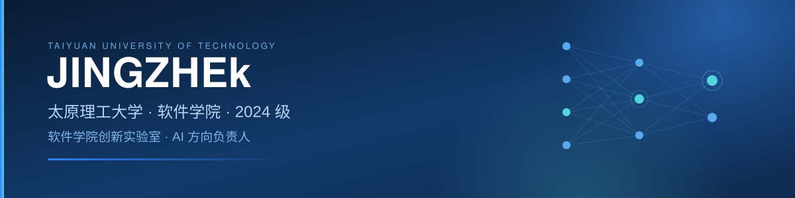
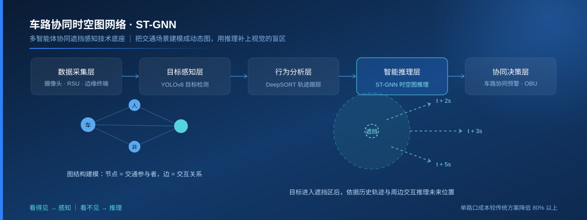
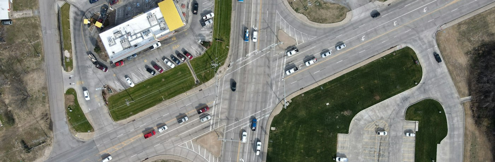
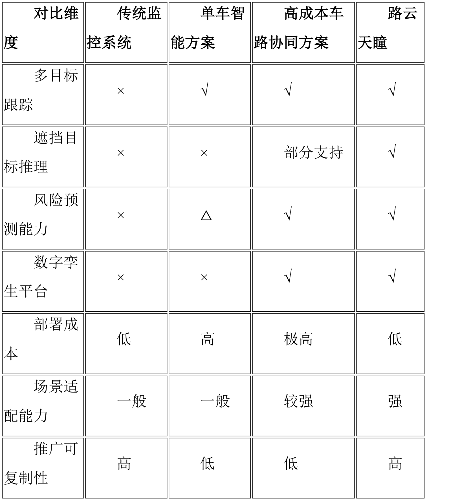
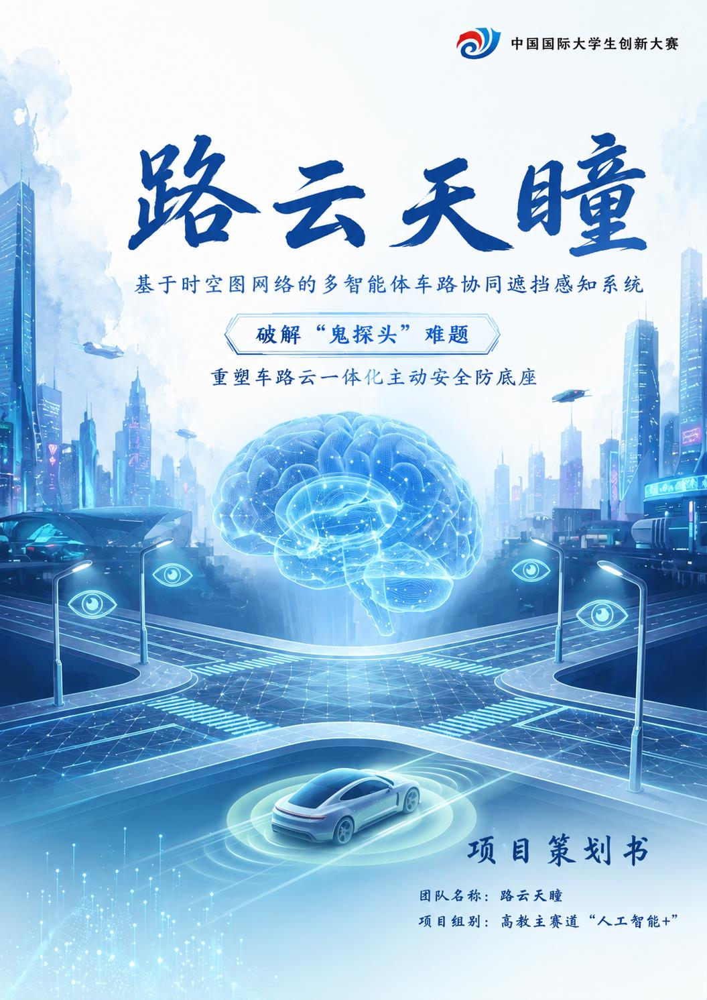
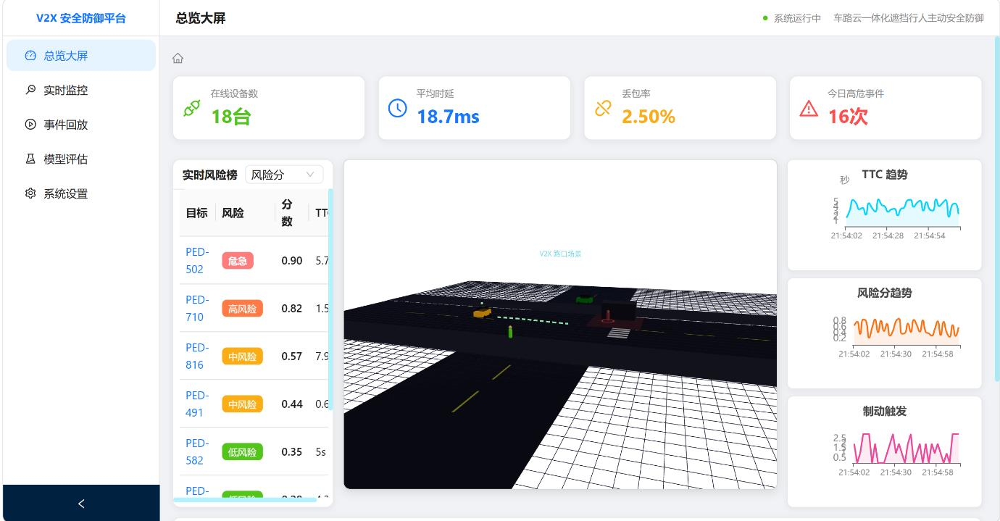
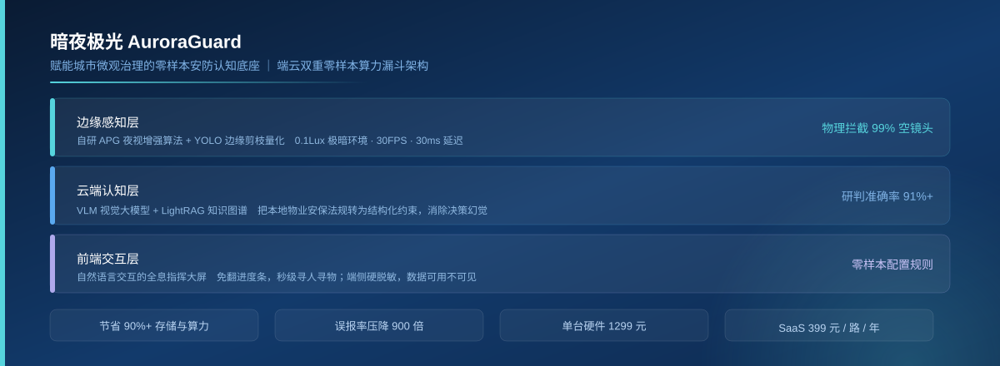
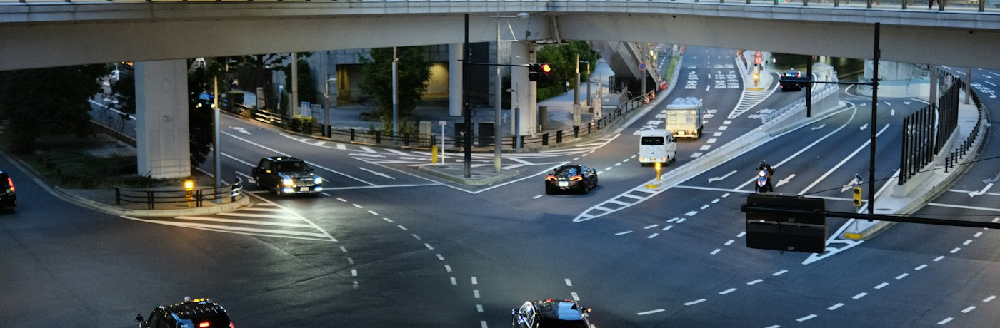

# Hi, I'm JINGZHEk

**AI 工程实践者 · 从算法原型到可运行系统**

太原理工大学软件学院 2024 级本科生，软件学院创新实验室 AI 方向负责人。 
关注机器学习、计算机视觉、图神经网络与边缘智能。

---

## 👋 关于我

我喜欢把想法一路推进到能运行、能验证、能展示的成品。目前负责实验室 AI 方向的选题规划、项目推进与新人带教，也在持续补足深度学习基础、模型工程化和算法竞赛能力。

- **正在做**：交通遮挡目标预测、车路协同感知、零样本安防
- **擅长做**：算法设计、原型开发、系统联调、项目材料表达
- **欢迎交流**：AI 项目选题、计算机类学科竞赛、实验室建设

## 🚀 精选项目

### ST-GNN 车路协同遮挡目标预测

> 把交通场景建模为动态图，用历史轨迹和多目标交互推理视觉盲区中的运动趋势。

| 核心工作 | 技术方案 | 我的角色 |
| --- | --- | --- |
| 遮挡目标 2 / 3 / 5 秒轨迹预测 | `PyTorch` · `ST-GNN` · `GAT` · `YOLOv8` · `DeepSORT` | 图结构建模、推理算法、实验验证 |

<strong>查看项目思路与方案对比</strong>

车载传感器无法看到公交车、建筑转角或绿化带后的目标。项目将行人、车辆和非机动车建模为节点，将跟车、会车与避让关系建模为边；视觉信息中断后，模型根据历史轨迹和邻居交互继续预测目标位置。

---

### 路云天瞳 · 多智能体车路协同系统

> 复用普通路侧摄像头，在边缘端完成感知、风险推理与分级预警，把算法原型落到完整系统。

| 核心工作 | 技术方案 | 我的角色 |
| --- | --- | --- |
| 感知、分析、推理、决策一体化原型 | `Python` · `Vue` · `V2X` · `边缘推理` · `数字孪生` | 方案、算法、系统与申报材料独立完成 |

<strong>查看系统能力</strong>

- 五层流水线：数据采集 → 目标感知 → 行为分析 → 智能推理 → 协同决策
- 分级响应：低风险状态提示、中风险语音预警、高风险紧急警报
- 可视化大屏：实时风险榜、TTC 趋势、风险分趋势与制动触发分析
- 参赛方向：中国国际大学生创新大赛高教主赛道「人工智能+」

---

### 暗夜极光 AuroraGuard · 零样本安防

> 让存量摄像头通过自然语言规则识别长尾事件，减少重新采集、标注和训练的成本。

| 核心工作 | 技术方案 | 我的角色 |
| --- | --- | --- |
| 低照度增强、事件筛选、云端语义研判 | `APG` · `YOLO` · `VLM` · `LightRAG` · `知识图谱` | 架构、算法、软硬件联调与商业测算 |

<strong>查看端云协同流程</strong>

边缘端先完成夜视增强和无效片段过滤，仅将候选事件上传云端；视觉语言模型负责语义研判，LightRAG 将本地安保规则转成可检索的约束。项目面向飞线充电、消防通道占用等非标准化安防事件。

---

## 🧰 技术栈

<picture>
  <source media="(prefers-color-scheme: dark)" srcset="https://skillicons.dev/icons?i=py,pytorch,tensorflow,opencv,sklearn,cpp,java,js,vue,linux,docker,git&theme=dark&perline=12" />
  <source media="(prefers-color-scheme: light)" srcset="https://skillicons.dev/icons?i=py,pytorch,tensorflow,opencv,sklearn,cpp,java,js,vue,linux,docker,git&theme=light&perline=12" />
  
</picture>

## 🏅 荣誉与竞赛

| 类别 | 成果 |
| --- | --- |
| 荣誉与奖学金 | 太原理工大学「青鸥奖」优秀人才奖 · 国家励志奖学金 · 校级一、二等奖学金 |
| 中国大学生计算机设计大赛 | 国家级二等奖 |
| 中国高校计算机大赛网络技术挑战赛 | 国家级三等奖 |
| 其他学科竞赛 | 多项省级、校级奖项 |

## 📊 GitHub 动态

<picture>
  <source media="(prefers-color-scheme: dark)" srcset="https://github-readme-stats.vercel.app/api?username=JINGZHEk&show_icons=true&hide_border=true&hide_title=true&theme=github_dark&locale=cn" />
  <source media="(prefers-color-scheme: light)" srcset="https://github-readme-stats.vercel.app/api?username=JINGZHEk&show_icons=true&hide_border=true&hide_title=true&locale=cn" />
  
</picture>

## 🤝 联系我

欢迎通过 [GitHub Issues](https://github.com/JINGZHEk/JINGZHEk/issues) 交流项目想法、竞赛合作与实验室建设。也可以直接浏览我的 [GitHub 主页](https://github.com/JINGZHEk) 了解最新项目。

项目场景配图来自 Unsplash，作者包括 Cody Hamblin、Barry Talley 与 Siborey Sean。
